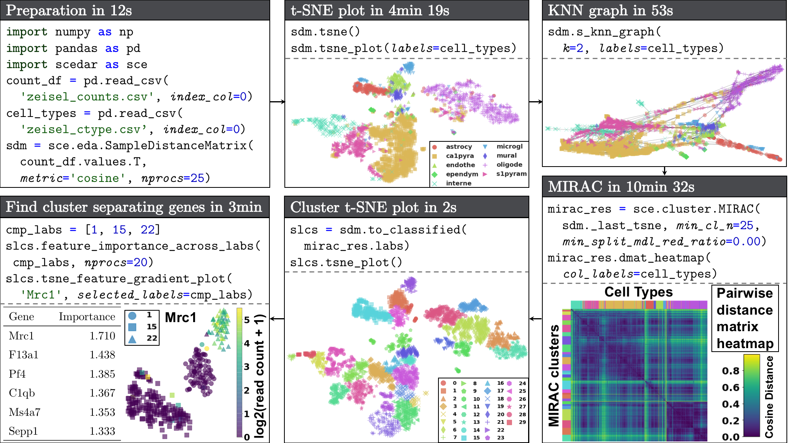

# Scedar

`Scedar` (Single-cell exploratory data analysis for RNA-Seq) is a reliable and easy-to-use Python package for efficient *visualization*, *imputation of gene dropouts*, *detection of rare transcriptomic profiles*, and *clustering* of large-scale single cell RNA-seq (scRNA-seq) datasets.

## Install

Use PyPI:

`pip install scedar`

## Demo

Workflow of using `scedar` to analyze an scRNA-seq dataset with 3005 mouse brain cells and 19,972 genes generated using the STRT-Seq UMI protocol by Zeisel et al. (2015). Procedures and parameters that are not directly related to data analysis are omitted. The full version of the demo is available at the [Tutorial](https://scedar.readthedocs.io/en/latest/notebooks/mb3k-demo.html) section of the documentation.

Data sources:

- Zeisel, A., Muñoz-Manchado, A. B., Codeluppi, S., Lönnerberg, P., La Manno, G., Juréus, A., Marques, S., Munguba, H., He, L., Betsholtz, C., Rolny, C., Castelo-Branco, G., Hjerling-Leffler, J., and Linnarsson, S. (2015). Brain structure. [Cell types in the mouse cortex and hippocampus revealed by single-cell RNA-seq](http://science.sciencemag.org/content/347/6226/1138). *Science*, **347**(6226), 1138–1142.
- [Hemberg Group scRNA-seq datasets](https://hemberg-lab.github.io/scRNA.seq.datasets/mouse/brain/#zeisel)

## Paper

Zhang, Y. and Taylor, D. M. (2018) Scedar: a scalable Python package for single-cell RNA-seq data analysis. *bioRxiv*, doi: [https://doi.org/10.1101/375196](https://doi.org/10.1101/375196).
